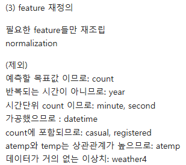
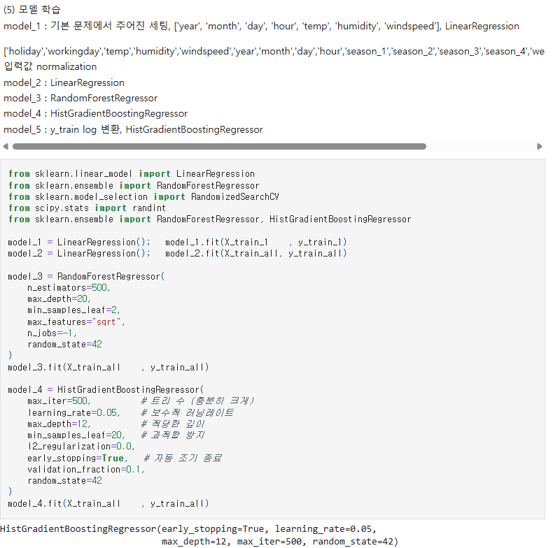
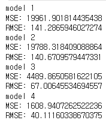
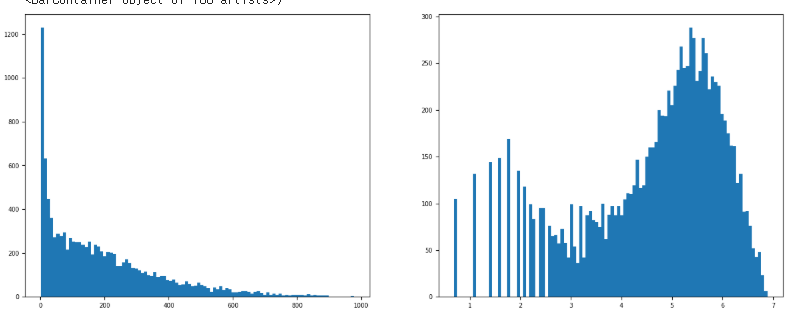
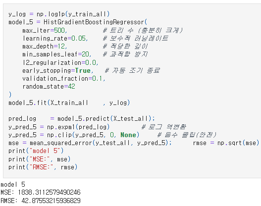
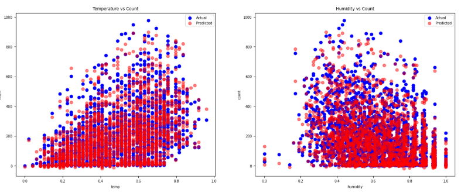
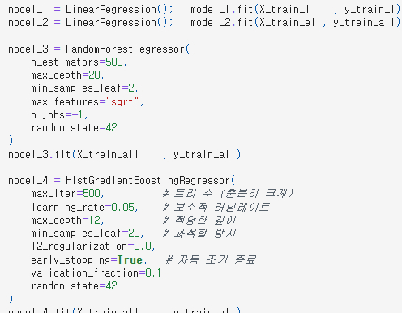
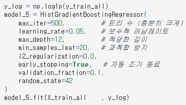
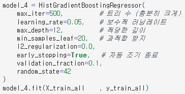

# AIFFEL Campus Online Code Peer Review Templete

- 코더 : 신재욱
- 리뷰어 : 이지연

# PRT(Peer Review Template)

- [ ] **1. 주어진 문제를 해결하는 완성된 코드가 제출되었나요?**  
       Project 1번을 수행하지 않았고, 노드에서 요구한 시각화 결과 또한 포함 되지 않았다.
- [x] **2. 전체 코드에서 가장 핵심적이거나 가장 복잡하고 이해하기 어려운 부분에 작성된 주석 또는 doc string을 보고 해당 코드가 잘 이해되었나요?**  
       

  왜 해당 feature를 삭제하였는지 이유를 기록해 두어 이해하기 쉬웠다.

- [x] **3. 에러가 난 부분을 디버깅하여 문제를 해결한 기록을 남겼거나 새로운 시도 또는 추가 실험을 수행해봤나요?**  
       
      

  Linear Regresssion 모델 외에 다양한 모델을 사용하여 RMSE 값을 낮추기 위한 실험을 진행하였고 실제로 새롭게 시도한 모든 모델에서 RMSE 값이 낮게 나온 것을 확인할 수 있었다.

  

  실제로 데이터의 편향성 문제를 해결하기 위해 로그를 사용하는 시도를 진행했지만 결과가 좋지 않았고 결국 로그를 사용하지 않기로 결정했다.

  

  다양한 실험을 진행한 결과 높은 정확도의 모델을 생성할 수 있었다.

  

- [ ] **4. 회고를 잘 작성했나요?**

  - 주어진 문제를 해결하는 완성된 코드 내지 프로젝트 결과물에 대해
    배운점과 아쉬운점, 느낀점 등이 기록되어 있는지 확인
  - 전체 코드 실행 플로우를 그래프로 그려서 이해를 돕고 있는지 확인
    - 중요! 잘 작성되었다고 생각되는 부분을 캡쳐해 근거로 첨부

- [ ] **5. 코드가 간결하고 효율적인가요?**

  동일한 모델에 입력 만 변화시키는 상황이라면 매번 모델을 새로 정의하지 않고 이전에 정의해 둔 모델을 그대로 사용하는 게 더 좋았을 것 같다.

  (HistGradientBoostingRegressor가 동일한 구성으로 3번 정의되어 있다.)

  

  

  

# 회고(참고 링크 및 코드 개선)

- Project 2에 대해서 다양한 시도를 한 것은 좋지만 Project 1을 수행하지 않은 것에 아쉬움이 남는다.
- 학습에 영향을 주는 요소에 y도 일부 영향은 주겠지만 더 큰 영향을 주는 것은 X의 편향성일 것이라 생각하기 때문에 로그를 사용하는 위치가 결과값인 y가 아니라 X의 인자 중 하나였다면 더 좋은 결과를 얻었을 것이라 생각한다.
- 동일한 모델에 입력만 변화시키는 경우 아래와 같이 정의하고 사용하는 것이 코드 중복을 막을 수 있을 것 같다.

```
model_HGBR = HistGradientBoostingRegressor(
    max_iter=500,          # 트리 수 (충분히 크게)
    learning_rate=0.05,    # 보수적 러닝레이트
    max_depth=12,          # 적당한 깊이
    min_samples_leaf=20,   # 과적합 방지
    l2_regularization=0.0,
    early_stopping=True,   # 자동 조기 종료
    validation_fraction=0.1,
    random_state=42
)

model_HGBR.fit(X_train_all    , y_train_all)
y_pred_4   = model_HGBR.predict(X_test_all)

# 정의된 모델에 이미 학습된 내용을 무시하고 덮어씀
y_log = np.log1p(y_train_all)
model_HGBR.fit(X_train_all    , y_log)
pred_log = model_HGBR.predict(X_test_all)

# 이미 새로운 학습 내용이 적용 되었으므로 다시 학습을 진행하여 기존 모델로 원복
model_HGBR.fit(X_train_all    , y_train_all)
y_pred_4   = model_HGBR.predict(X_test_all)
```
