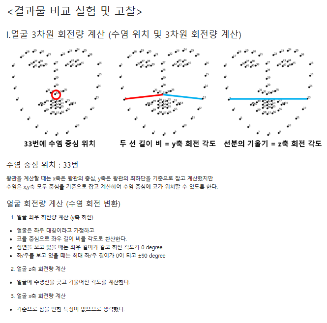

# README

# AIFFEL Campus Online Code Peer Review Templete

- 코더 : 신재욱.
- 리뷰어 : 임보혁.

# PRT(Peer Review Template)

- [x] **1. 주어진 문제를 해결하는 완성된 코드가 제출되었나요?**
  - 문제에서 요구하는 최종 결과물이 첨부되었는지 확인
    - 중요! 해당 조건을 만족하는 부분을 캡쳐해 근거로 첨부
    채점 기준 1,2,3 충족
    
    
- [x] **2. 전체 코드에서 가장 핵심적이거나 가장 복잡하고 이해하기 어려운 부분에 작성된
      주석 또는 doc string을 보고 해당 코드가 잘 이해되었나요?**

      

      - 스티커를 y축으로 회전시키기 위해 랜드마크를 기준으로 계산하는 부분
      - 이해가 잘 되었음.

- [x] **3. 에러가 난 부분을 디버깅하여 문제를 해결한 기록을 남겼거나
      새로운 시도 또는 추가 실험을 수행해봤나요?** - 디버깅으로 인한 문제 해결은 없었으나, - 스티커를 y,z 축으로 회전 시키기 위한 새로운 시도 고찰이 있었음.
          

- [ ] **4. 회고를 잘 작성했나요?**
  - 회고는 없었음.
- [x] **5. 코드가 간결하고 효율적인가요?**
  - PEP8을 준수하고, 복잡한 기능에 대해서 함수화를 하여 코드의 가독성을 높힘

# 회고(참고 링크 및 코드 개선)

```
detector·predictor는 한 번만 생성하고 재사용해서 좋은 것 같습니다.
cvtColor는 중복 호출이 조금 횟수가 많지않았나? 하는 생각입니다.

얼굴이 회전함에 따라 스티커도 돌아가게 하는 기능이 인상 깊었습니다.
```
