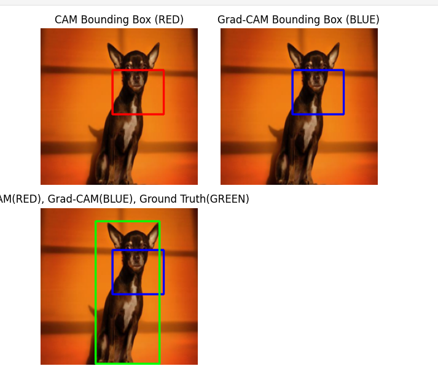
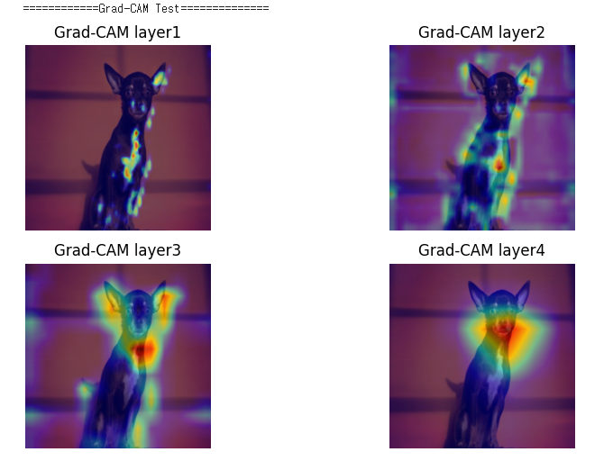
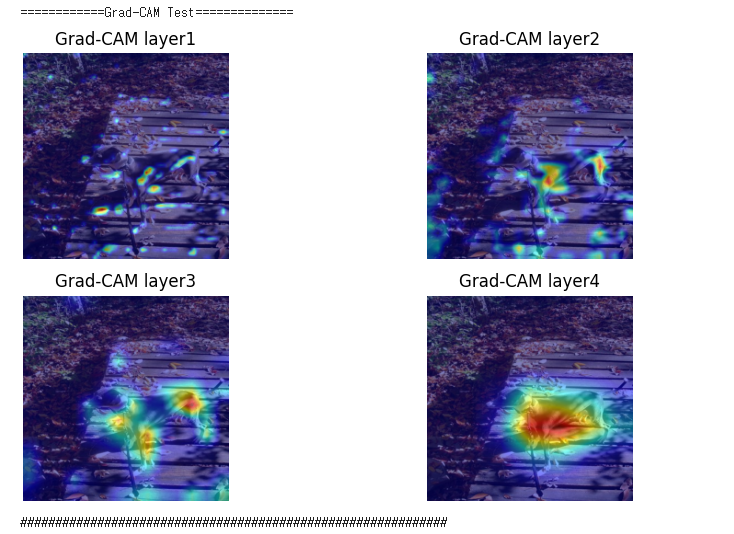
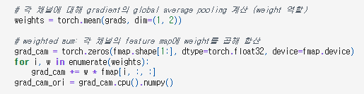
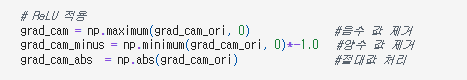
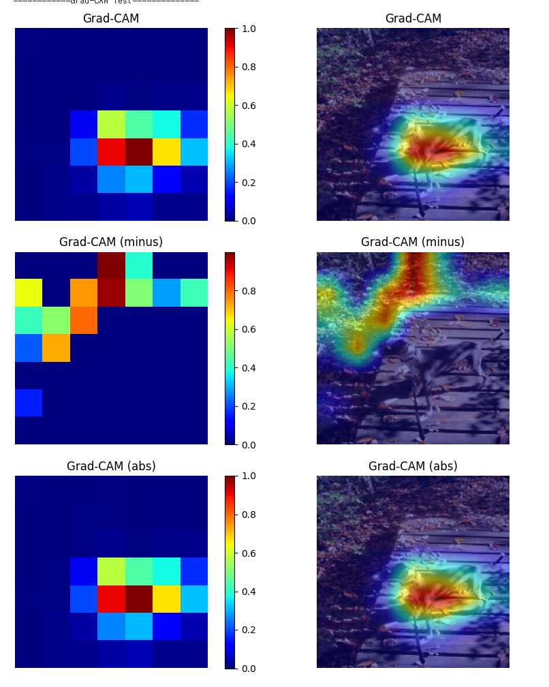
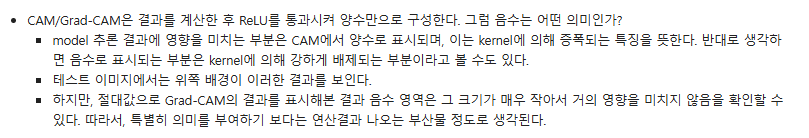
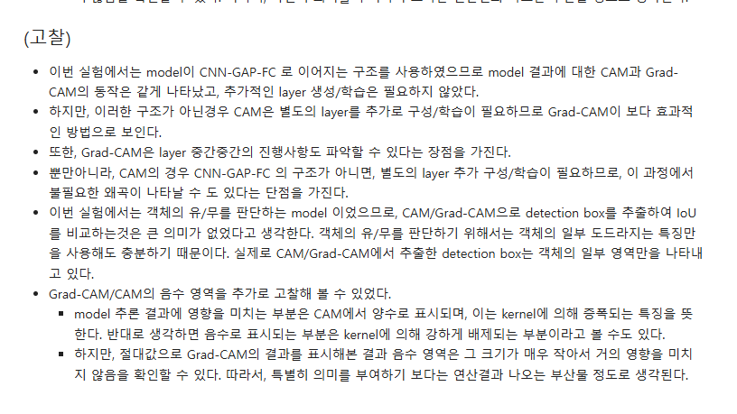

# README

# AIFFEL Campus Online Code Peer Review Templete

- 코더 : 신재욱
- 리뷰어 : 임보혁

# PRT(Peer Review Template)

- [x] **1. 주어진 문제를 해결하는 완성된 코드가 제출되었나요?**
- 주어진 문제를 거의 완벽하게 해결하셨습니다.
  - 다만 ResNet50 + GAP + DenseLayer 결합된 CAM 모델의 학습과정이 안정적으로 수렴한 부분이 빠졌습니다.
    
    
    
- [x] **2. 전체 코드에서 가장 핵심적이거나 가장 복잡하고 이해하기 어려운 부분에 작성된
      주석 또는 doc string을 보고 해당 코드가 잘 이해되었나요?**
      

      

      - 코드에 주석이 잘 나와있습니다.
- [x] **3. 에러가 난 부분을 디버깅하여 문제를 해결한 기록을 남겼거나
      새로운 시도 또는 추가 실험을 수행해봤나요?**
      

      

      

      - CAM/Grad-CAM은 결과를 계산한 후 ReLU를 통과시켜 양수만으로 구성한다. 그럼 음수는 어떤 의미인지 실험을 통해 정리하셨습니다.
      - 바운딩 박스의 색을 다르게 정의
- [x] **4. 회고를 잘 작성했나요?**
  
  - 회고가 잘 작성되었습니다.
- [x] **5. 코드가 간결하고 효율적인가요?**
  - 모두 만족하였습니다.

# 회고(참고 링크 및 코드 개선)

```
CAM, Grad-CAM에 대한 실험, 결과에 대한 고찰, ReLu의 0 밑으로 버려지는 음수에 대한 고찰과 시각화, 또, 그에 대한 절대값의 시각화가 인상 깊었습니다. Minus를 사용한 Grad-CAM에서 활성화된 부분을 Masking하면 객체를 강제로 찾게 할 수 있지않을까? 하는 생각도 듭니다. 반대로 양수를 사용하는 Grad-CAM에서 활성화된 부분을 Masking하면, 얼굴만 보고 판단한 것을 다른 부분을 보고 판단하게 만들 수 있지않을까? 하는 생각도 드는 것 같습니다.
```
