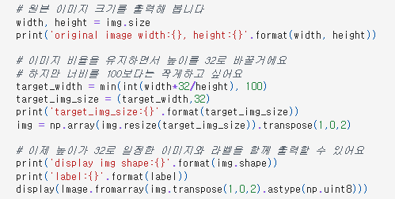
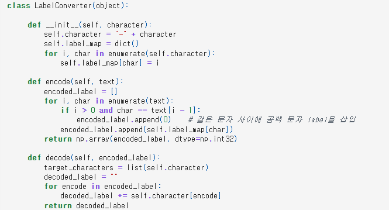
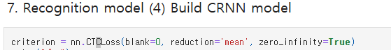
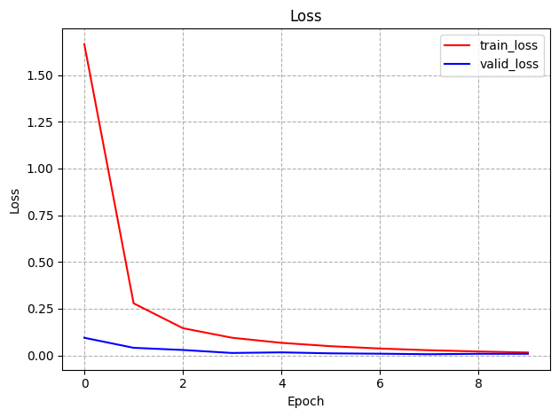
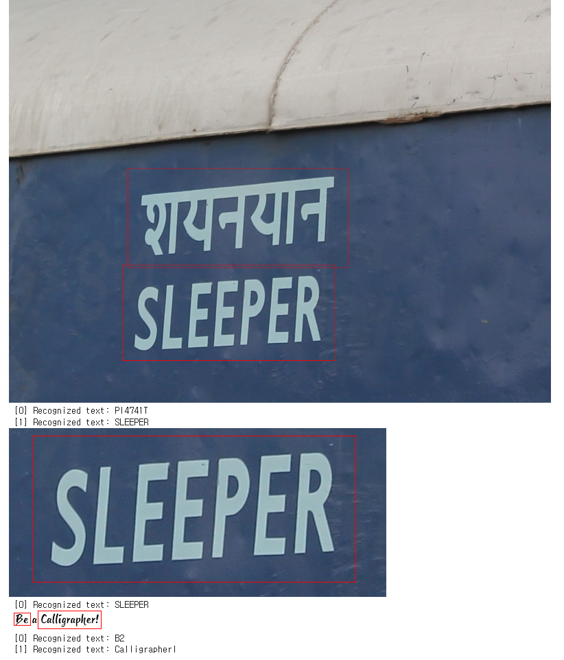
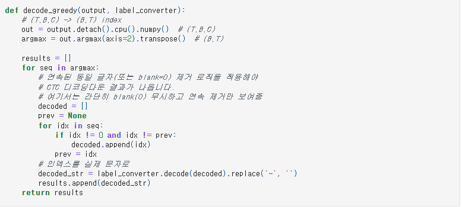
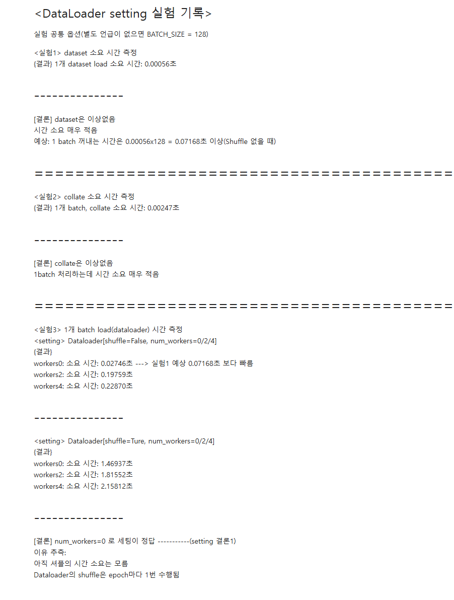
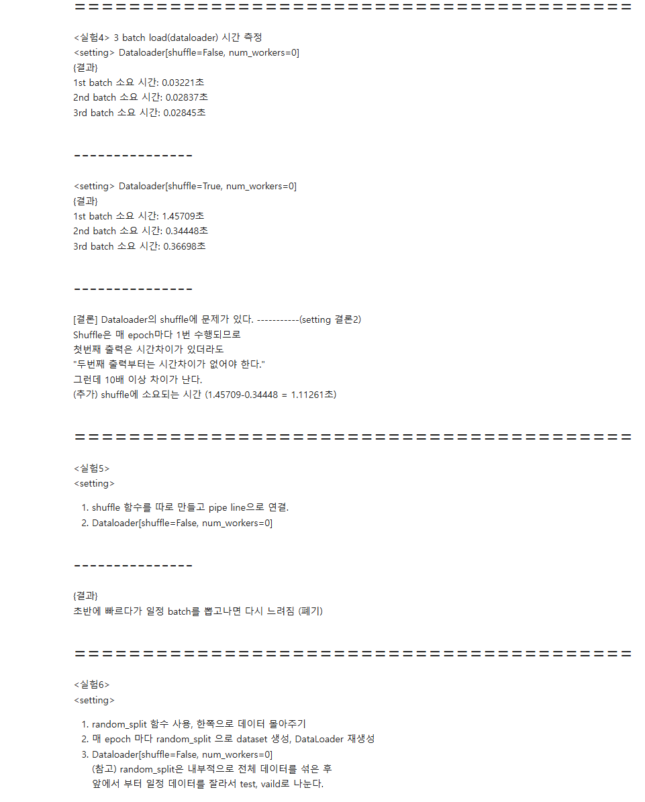
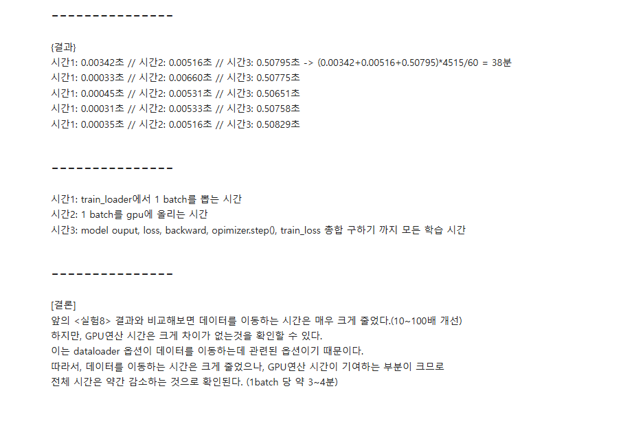
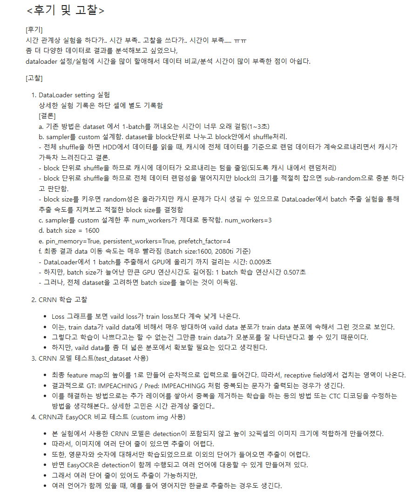

# README

# AIFFEL Campus Online Code Peer Review Templete

- 코더 : 신재욱
- 리뷰어 : 임보혁

# PRT(Peer Review Template)

- [ ] **1. 주어진 문제를 해결하는 완성된 코드가 제출되었나요?**
  
  
  
- Text recognition을 위해 특화된 데이터셋 구성이 체계적으로 진행되었다.
- 텍스트 이미지 리사이징, ctc loss 측정을 위한 라벨 인코딩, 배치처리 등이 적절히 수행되었다.
  
  
- CRNN 기반의 recognition 모델의 학습이 정상적으로 진행되었다.
- 다만 val_loss가
  batch_limit로 100배치만 돌면서도 `len(valid_loader)` 로 나누고 있어 이상할 정도로 낮게 찍힘.
- 예를 들어 `len(valid_loader) = 2000`, `batch_limit = 100` 이면,
  실제로 더한 것은 100개 배치의 loss 합인데, 나눌 때는 2000으로 나누면
  실제 평균보다 **20배 작게** 찍힘

- easy ocr - detector와 CRNN recognizer를 엮어 원본 이미지 입력으로부터 text가 출력되는 OCR이 End-to-End로 구성되었다.
  
- 샘플 이미지를 원본으로 받아 OCR 수행 결과를 리턴하는 1개의 함수가 만들어졌다.
- [x] **2. 전체 코드에서 가장 핵심적이거나 가장 복잡하고 이해하기 어려운 부분에 작성된
      주석 또는 doc string을 보고 해당 코드가 잘 이해되었나요?** - 주석이 잘 작성되어있습니다.
          

- [x] **3. 에러가 난 부분을 디버깅하여 문제를 해결한 기록을 남겼거나
      새로운 시도 또는 추가 실험을 수행해봤나요?** - 자세하게 작성되었습니다.
          






- [x] **4. 회고를 잘 작성했나요?**
  - 자세하게 작성되었습니다.
    
- [x] **5. 코드가 간결하고 효율적인가요?**
  - 모두 간결합니다.

# 회고(참고 링크 및 코드 개선)

```
데이터로더 병목현상에 대해 다양한 조건을 주어 실험한 부분이 인상 깊었습니다.

val_loss를 구하는 부분이 이상합니다.
다만, val_loss가 batch_limit로 100배치만 돌면서도 `len(valid_loader)` 로 나누고 있어 이상할 정도로 낮게 찍힘.
예를 들어 `len(valid_loader) = 2000`, `batch_limit = 100` 이면, 실제로 더한 것은 100개 배치의 loss 합인데, 나눌 때는 2000으로 나누면 실제 평균보다 20배 작게 찍힘
```
