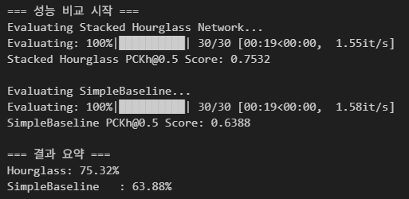
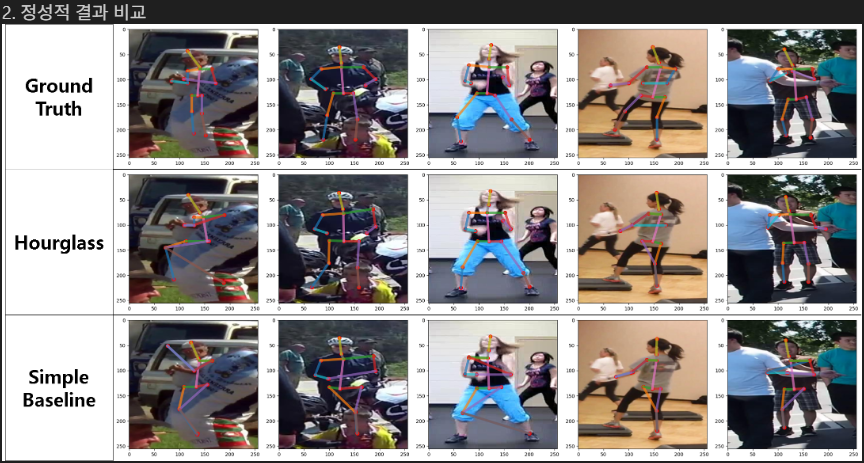
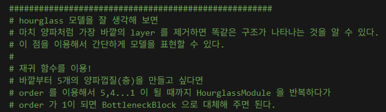
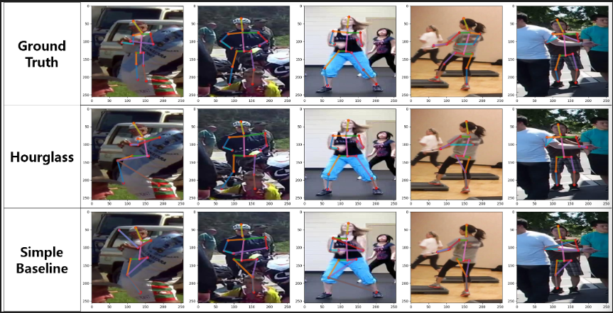
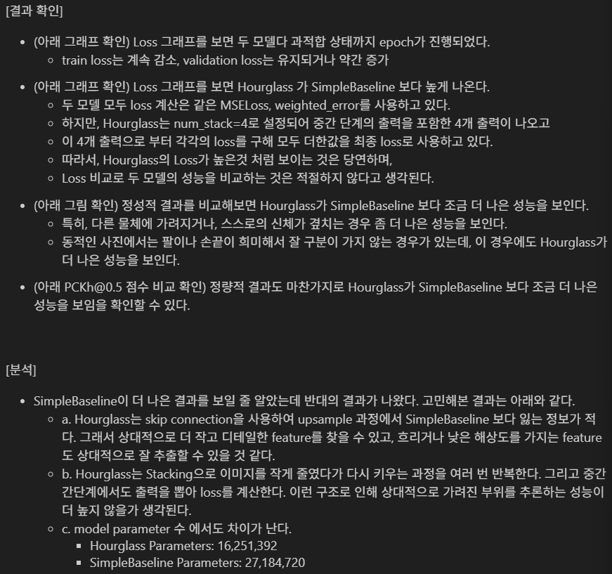
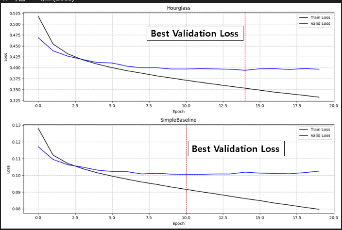
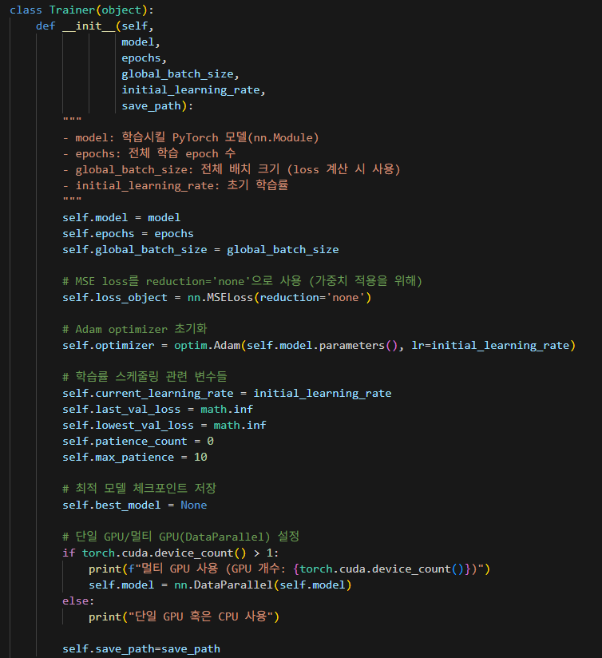
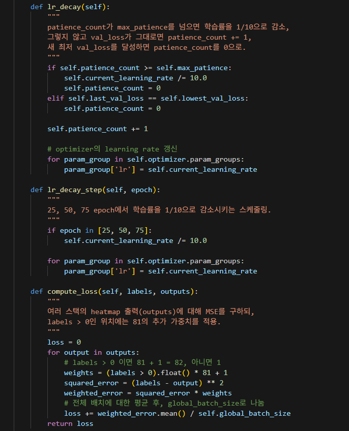
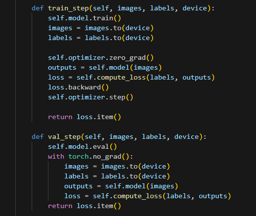
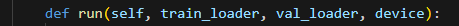

# AIFFEL Campus Online Code Peer Review Templete
- 코더 : 신재욱
- 리뷰어 : 이수호


# PRT(Peer Review Template)
- [X]  **1. 주어진 문제를 해결하는 완성된 코드가 제출되었나요?**
    - 문제에서 요구하는 최종 결과물이 첨부되었는지 확인
        - 중요! 해당 조건을 만족하는 부분을 캡쳐해 근거로 첨부  
        - 모델 비교를 정량적, 정성적으로 나누어 비교하였음  
          
          
    
- [X]  **2. 전체 코드에서 가장 핵심적이거나 가장 복잡하고 이해하기 어려운 부분에 작성된 
주석 또는 doc string을 보고 해당 코드가 잘 이해되었나요?**
    - 해당 코드 블럭을 왜 핵심적이라고 생각하는지 확인
    - 해당 코드 블럭에 doc string/annotation이 달려 있는지 확인
    - 해당 코드의 기능, 존재 이유, 작동 원리 등을 기술했는지 확인
    - 주석을 보고 코드 이해가 잘 되었는지 확인
        - 중요! 잘 작성되었다고 생각되는 부분을 캡쳐해 근거로 첨부
        - StackedHourglass model에서 재귀함수를 사용하는 이유와 어떻게 사용하였는지를 잘 설명하고 있다.  
        
        
- [X]  **3. 에러가 난 부분을 디버깅하여 문제를 해결한 기록을 남겼거나
새로운 시도 또는 추가 실험을 수행해봤나요?**
    - 문제 원인 및 해결 과정을 잘 기록하였는지 확인
    - 프로젝트 평가 기준에 더해 추가적으로 수행한 나만의 시도, 
    실험이 기록되어 있는지 확인
        - 중요! 잘 작성되었다고 생각되는 부분을 캡쳐해 근거로 첨부
        - 정량적 평가를 추가적으로 수행했다.  
        
        
- [X]  **4. 회고를 잘 작성했나요?**
    - 주어진 문제를 해결하는 완성된 코드 내지 프로젝트 결과물에 대해
    배운점과 아쉬운점, 느낀점 등이 기록되어 있는지 확인
    - 전체 코드 실행 플로우를 그래프로 그려서 이해를 돕고 있는지 확인
        - 중요! 잘 작성되었다고 생각되는 부분을 캡쳐해 근거로 첨부
        - loss 함수에서 StackedHourglass model이 SimpleBaseline model보다 loss가 더 크게 나온 이유에 대해 고민하고 분석한 결과를 기록해 두었고, 실제 성능에 대한 비교도 잘 진행한 것 같다.  
          
          
        
- [X]  **5. 코드가 간결하고 효율적인가요?**
    - 파이썬 스타일 가이드 (PEP8) 를 준수하였는지 확인
    - 코드 중복을 최소화하고 범용적으로 사용할 수 있도록 함수화/모듈화했는지 확인
        - 중요! 잘 작성되었다고 생각되는 부분을 캡쳐해 근거로 첨부  
        - Trainer class를 선언함으로써 훈련에 필요한 다양한 기능을 해당 클래스의 함수로 선언하였다.  
          
          
          
          
        

# 회고(참고 링크 및 코드 개선)
```
# 리뷰어의 회고를 작성합니다.
# 코드 리뷰 시 참고한 링크가 있다면 링크와 간략한 설명을 첨부합니다.
# 코드 리뷰를 통해 개선한 코드가 있다면 코드와 간략한 설명을 첨부합니다.
  
  
validation set에서 일부를 뽑아 정성적 비교를 진행한 부분이 좋았던 것 같다. 그리고, loss에 대한 결과를 분석하는 데 있어서 Hourglass가 SimpleBaseline보다 높게 나온 것에 대해 분석한 점 또한 대단한 것 같다. 리뷰어(이수호)는 SimpleBaseline이 당연히 SimpleBaseline이 더 상위 모델이기 때문에 loss가 작게 나오는 것이 당연하다고 생각했었다. 근데 또 정성적 평가를 했을 때 성능이 Hourglass가 더 잘나와서 "뭐지?" 하는 생각이 들었었는데... Hourglass의 loss를 구하는 과정에서 이런 과정이 있었는지는 코드를 깊게 살펴보지 않아 몰랐다.
아쉬운 점은 그렇다면 상위 모델인 SimpleBaseline이 Hourglass보다 일반화 성능이 낮은 이유가 무엇인지에 대한 고민이 없어서 아쉬운 것 같다.
```
